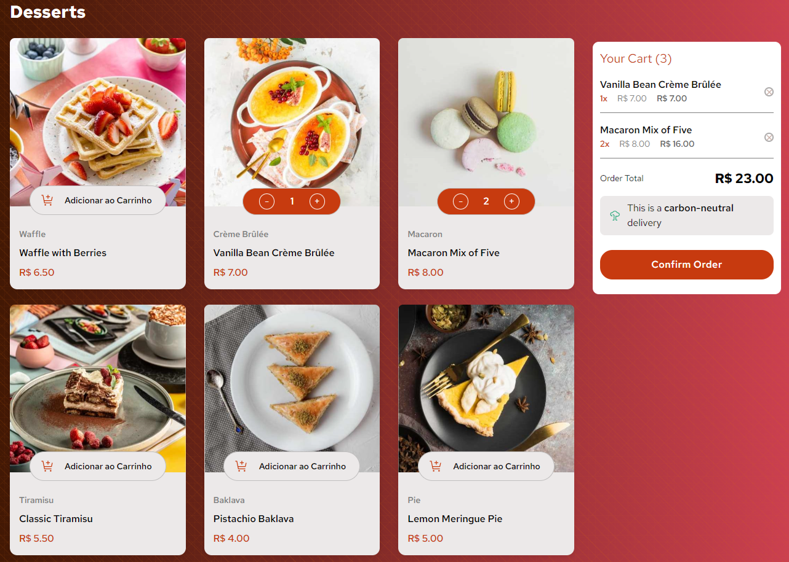

# Carrinho de Compras

Este é um projeto de carrinho de compras desenvolvido em TypeScript, utilizando Vite como ferramenta de construção. O projeto permite que os usuários visualizem produtos, adicionem itens ao carrinho e finalizem pedidos.



## Funcionalidades

- Visualização de produtos com imagens, nomes, categorias e preços.
- Adição e remoção de produtos do carrinho.
- Controle de quantidade de produtos no carrinho.
- Modal para confirmação de pedidos.

## Tecnologias Utilizadas

- **TypeScript**: Para tipagem estática e melhor manutenção do código.
- **Vite**: Ferramenta de construção rápida e leve para desenvolvimento.
- **Tailwind CSS**: Framework CSS para estilização responsiva.
- **UUID**: Para geração de IDs únicos para produtos.

## Instalação

1. Clone o repositório:

   ```bash
   git clone https://github.com/seu-usuario/carrinho-de-compras.git
   cd carrinho-de-compras
   ```

2. Instale as dependências:

   ```bash
   npm install
   ```

## Uso

1. Para iniciar o servidor de desenvolvimento, execute:

   ```bash
   npm run dev
   ```

2. Abra o navegador e acesse a localhost e porta que o Vite indicar.

3. Você verá a lista de produtos disponíveis. Você pode adicionar produtos ao carrinho e ajustar as quantidades.

4. Clique no botão de confirmação de pedido para abrir o modal de confirmação.